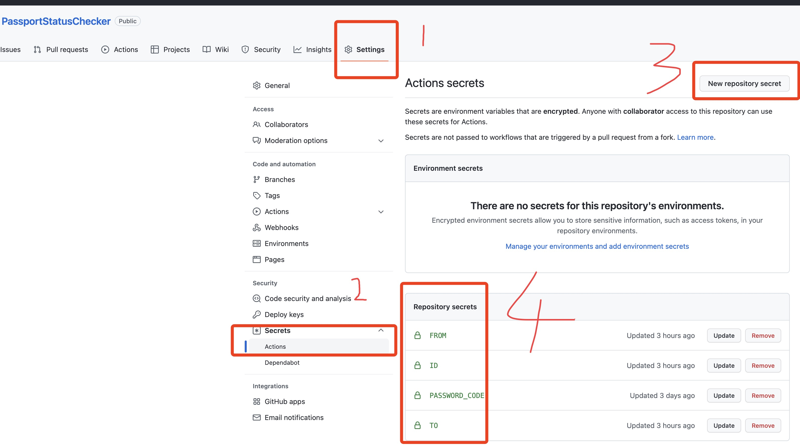
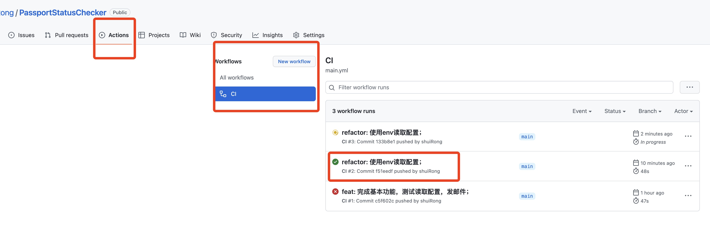

# PassportStatusChecker

定时自动检查广东政务服务网上自己的护照办理进度，如果状态有变化，给自己发邮件。这样就不用一天手动查询好多遍了。

> 本定时程序，只对在广东办护照的人有用，因为我只适配了广东政务服务网。但如果懂代码的话，稍微改改，也是能很容易适配其他省的护照状态查询网站的。

## 如何使用？

1. fork 本仓库
2. 按照图片步骤，在自己 fork 的仓库设置里配置发邮件相关的信息

   **配置解释：**

- （对了，在输配置时不需要给他们加上引号）
- FROM：用来发邮件的邮箱，比如我用的 QQ 邮箱
- TO：接收方的邮箱，比如我另一个邮箱（使用相同的 QQ 邮箱应该也是可以的，就是自己给自己发）
- ID：身份证 ID
- PASSWORD_CODE：邮箱登录授权码/登录密码（QQ 邮箱的话，就得用登录授权码，[如何获取？](https://www.topgoer.com/%E5%85%B6%E4%BB%96/%E5%8F%91%E9%82%AE%E4%BB%B6.html)）

  

3. 一个小时后观察 Github Actions 是否成功执行。

   

4. 如果你觉得每小时查询一次频率太低，想每 10 分钟查询一次的话，可以在 fork 后，自行修改 `.github/workflows/main.yml` 里的 `cron` 配置。cron 的规则请自行 Google。但建议不要把频率调得太高，防止给网站造成太大压力，影响其他用户正常使用，每小时就够了其实。
